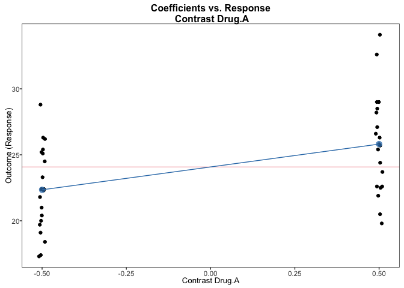
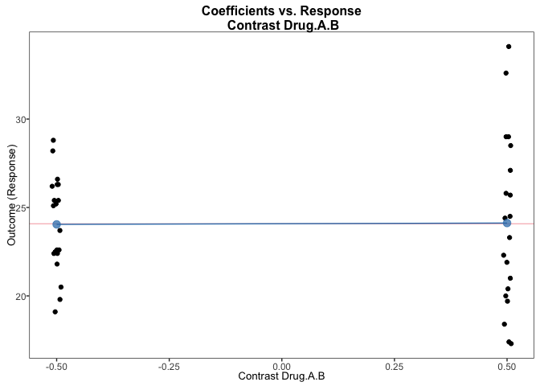

<!-- README.md is generated from README.Rmd. Please edit that file -->

# granovaGG

<!-- badges: start -->
<!-- badges: end -->

The package granovaGG is designed to produce statistical graphics driven
by the fundamental questions of analysis of variance. The graphics
granovaGG creates can offer far more visual information than a
traditional tabular model summary or significance test. For an example
of how granovaGG can enhance analysis, see [Pruzek and Helmreich
(2011)](https://rmpruzek.com/wp-content/uploads/2011/07/ElementalGraphicsForANOVA.finalJune11.pdf).

## Installation

You can install the development version of granovaGG from
[GitHub](https://github.com) with:

``` r
# install.packages("devtools")
devtools::install_github("briandk/granovaGG")
```

## Usage

There are three main functions in this package:

- `granovagg.1w()`: for plotting one-way analysis of variance (ANOVA)

- `granovagg.ds`(): for plotting dependent-sample t-test data

- `granovagg.contr()`: for plotting contrasts

## Examples

### `granovagg.1w()`

``` r
library(granovaGG)
data(poison)

# Note violation of constant variance across groups in following graphic.
granovagg.1w(poison$SurvTime, group = poison$Group, ylab = "Survival Time")
#> 
#> By-group summary statistics for your input data (ordered by group means)
#>    group group.mean trimmed.mean contrast variance standard.deviation
#> 3      3       0.21         0.21    -0.27     0.00               0.02
#> 9      9       0.23         0.23    -0.24     0.00               0.01
#> 2      2       0.32         0.32    -0.16     0.01               0.08
#> 12    12       0.32         0.32    -0.15     0.00               0.03
#> 6      6       0.33         0.33    -0.14     0.00               0.05
#> 8      8       0.38         0.38    -0.10     0.00               0.06
#> 1      1       0.41         0.41    -0.07     0.00               0.07
#> 7      7       0.57         0.57     0.09     0.02               0.16
#> 10    10       0.61         0.61     0.13     0.01               0.11
#> 11    11       0.67         0.67     0.19     0.07               0.27
#> 5      5       0.81         0.81     0.34     0.11               0.34
#> 4      4       0.88         0.88     0.40     0.03               0.16
#>    group.size
#> 3           4
#> 9           4
#> 2           4
#> 12          4
#> 6           4
#> 8           4
#> 1           4
#> 7           4
#> 10          4
#> 11          4
#> 5           4
#> 4           4
#> 
#> The following groups are likely to be overplotted
#>   group group.mean contrast
#> 3     2       0.32    -0.16
#> 4    12       0.32    -0.15
#> 5     6       0.33    -0.14
#> 
#> Below is a linear model summary of your input data
#> 
#> Call:
#> lm(formula = score ~ group, data = owp$data)
#> 
#> Residuals:
#>      Min       1Q   Median       3Q      Max 
#> -0.32500 -0.04875  0.00500  0.04312  0.42500 
#> 
#> Coefficients:
#>             Estimate Std. Error t value Pr(>|t|)    
#> (Intercept)  0.41250    0.07457   5.532 2.94e-06 ***
#> group2      -0.09250    0.10546  -0.877 0.386230    
#> group3      -0.20250    0.10546  -1.920 0.062781 .  
#> group4       0.46750    0.10546   4.433 8.37e-05 ***
#> group5       0.40250    0.10546   3.817 0.000513 ***
#> group6      -0.07750    0.10546  -0.735 0.467163    
#> group7       0.15500    0.10546   1.470 0.150304    
#> group8      -0.03750    0.10546  -0.356 0.724219    
#> group9      -0.17750    0.10546  -1.683 0.101000    
#> group10      0.19750    0.10546   1.873 0.069235 .  
#> group11      0.25500    0.10546   2.418 0.020791 *  
#> group12     -0.08750    0.10546  -0.830 0.412164    
#> ---
#> Signif. codes:  0 '***' 0.001 '**' 0.01 '*' 0.05 '.' 0.1 ' ' 1
#> 
#> Residual standard error: 0.1491 on 36 degrees of freedom
#> Multiple R-squared:  0.7335, Adjusted R-squared:  0.6521 
#> F-statistic:  9.01 on 11 and 36 DF,  p-value: 1.986e-07
```


### `granovagg.ds()`

``` r
library(granovaGG)

# This example corresponds to case 1b in Pruzek and Helmreich (2009). In this
# graphic we're looking for the effect of Family Treatment on patients with anorexia.

data(anorexia.sub)

granovagg.ds(anorexia.sub,
             revc = TRUE,
             main = "Assessment Plot for weights to assess\nFamily Therapy treatment for Anorexia Patients",
             xlab = "Weight after therapy (lbs.)",
             ylab = "Weight before therapy (lbs.)"
)    
#>                               Summary Statistics
#> n                                         17.000
#> Postwt mean                               90.494
#> Prewt mean                                83.229
#> mean(D = Postwt - Prewt)                   7.265
#> SD(D)                                      7.157
#> Effect Size                                1.015
#> r(Postwt, Prewt)                           0.538
#> r(Postwt + Prewt, D)                       0.546
#> Lower 95% Confidence Interval             10.945
#> Upper 95% Confidence Interval              3.585
#> t (D-bar)                                  4.185
#> df.t                                      16.000
#> p-value (t-statistic)                      0.001
#> Coordinate system already present. Adding new coordinate system, which will
#> replace the existing one.
```


### `granovagg.contr()`

``` r
data(arousal)  
contrasts22 <- data.frame( c(-.5,-.5,.5,.5), 
  c(-.5,.5,-.5,.5), c(.5,-.5,-.5,.5) )
names(contrasts22) <- c("Drug.A", "Drug.B", "Drug.A.B")
granovagg.contr(arousal, contrasts = contrasts22)
#> [[1]]
```



    #> 
    #> [[2]]


    #> 
    #> [[3]]



    #> 
    #> [[4]]
    #> Warning in mean.default(response): argument is not numeric or logical:
    #> returning NA

    #> Warning in mean.default(response): argument is not numeric or logical:
    #> returning NA
    #> Warning: Removed 10 rows containing missing values (`geom_hline()`).


## FAQs

## Isn’t there already a granova package on CRAN?

[Yes](https://cran.r-project.org/package=granova).

## So what’s the difference between granova and granovaGG?

There are several, actually.

First, the current version of granova on CRAN uses R’s base graphics to
produce plots. `granovaGG`, on the other hand, uses an R package called
[ggplot2](https://cran.r-project.org/package=ggplot2), which offers a
much greater degree of expressiveness and extensibility.

Second, 3-D functionality for creating an elemental graphic for 2-way
ANOVA is only in granova; granovaGG doesn’t have it.

In short, `granovaGG` offers ggplot2-based versions of three of the four
core functions in `granova`:

- `granova.1w`
- `granova.contr`
- `granova.ds`

## Do I have to choose between granova and granovaGG?

Absolutely not. You can have your granova cake with granovaGG icing!

The packages are currently designed to work side-by-side, which means
you can load them both and get the most out of their respective
strengths.

And, if you already have legacy granova code but would like to use the
new ggplot2-based functions in granovaGG, the transition is easy: just
add two letters to your function call.

So, suppose you have some code that uses three classic functions:

``` r
granova.contr(arousal, contrasts = contrasts22)
granova.ds(blood_lead)
granova.1w(poison$SurvTime, group = poison$Group, ylab = "Survival Time")
```

You can pipe the same code through granovaGG adding a “gg” after the
“granova” part of the function call:

``` r
granovagg.contr(arousal, contrasts = contrasts22)
granovagg.ds(blood_lead)
granovagg.1w(poison$SurvTime, group = poison$Group, ylab = "Survival Time")
```

## How can I provide feedback?

- If you want to request something, or report a bug, use the [Issue
  Tracker](https://github.com/briandk/granovaGG/issues)
- If you’d like to contact us directly, we’d love to hear from you:
  - [Brian A. Danielak](mailto:briandanielak+granovagg@gmail.com)
  - [William E. J. Doane](mailto:wdoane@Bennington.edu)
  - [James E. Helmreich](mailto:James.Helmreich@marist.edu)
  - [Jason Bryer](mailto:jason@bryer.org)
